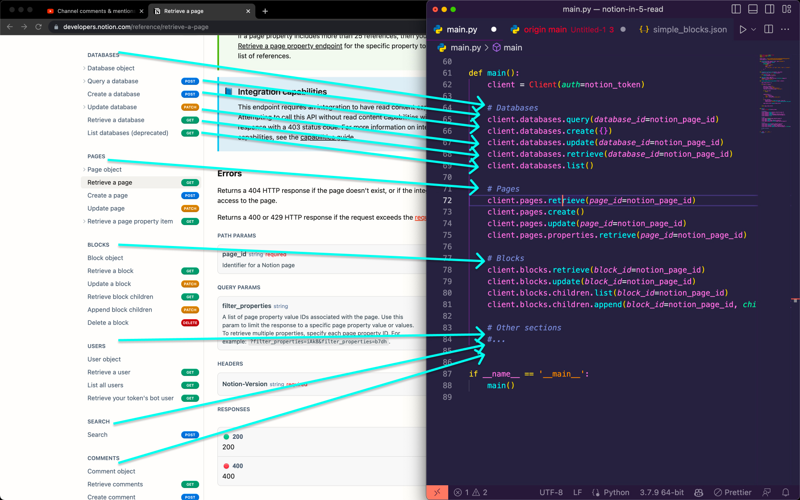

# Notion Examples - Using Notion SDK Client

Uses [ramnes/notion-sdk-py](https://github.com/ramnes/notion-sdk-py).

All examples taken from [Dan Isler's Notion in 5 Minutes](https://danisler.com/dev/notion-in-5-minutes).

